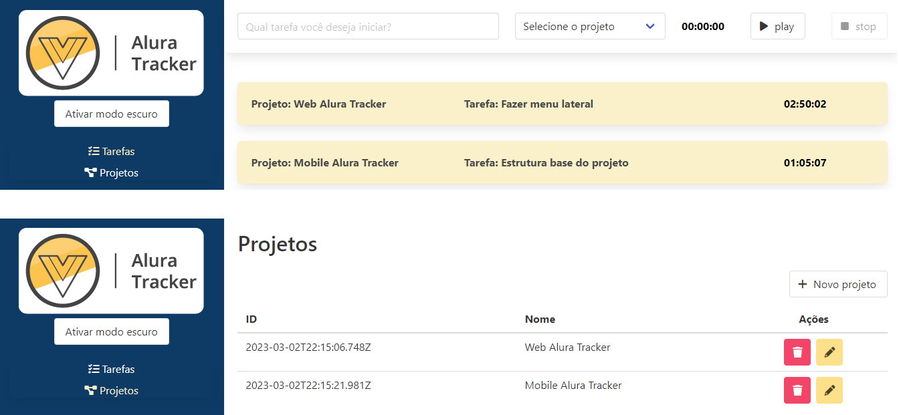

<h1 align="center">
  
</h1>

<h3 align="center">
  Curso de Vue3: Explorando o framework / Avançando no framework / Composition API e Vuex da Alura
</h3>

<p align="center">Desenvolvimento de uma simples aplicação que registra projetos o tempo gasto em cada tarefa do projeto</p>

<p align="center">Por Vinicios Neves - Alura</p>

<p align="center">
  <a href="#como-executar-o-projeto">Como executar o projeto</a>&nbsp;&nbsp;&nbsp;|&nbsp;&nbsp;
  <a href="#conteúdo-do-curso">Conteúdo do curso</a>
</p>

<p align="center">Front-end</p>

<p align="center">
  
</p>

## Como executar o projeto

### Requisitos

- [Node.js](https://nodejs.org)

### Clonar este repositório

```bash
git clone https://github.com/eliasmcastro/alura-tracker.git
```

### Back-end

Vamos utilizar uma fake API para prover os dados, para isso entre na pasta back-end e execute

- `npm install` para instalar as dependências do projeto
- `npm run serve` para iniciar a API fake

As rotas disponíveis são:

- http://localhost:3333/projects
- http://localhost:3333/tasks

### Front-end

Para executar o front-end, entre na pasta front-end e execute

- `npm install` para instalar as dependências do projeto
- `npm run serve` para iniciar o servidor de desenvolvimento
- Acessar http://localhost:8080

## Conteúdo do curso

### Curso de Vue3: explorando o framework

- Diferenças entre as versões 2 e 3 do Vue
- Vantagens de se utilizar Vue.JS com TypeScript
- Comunicação entre componentes filho -> pai
- Integração das variáveis de um componente com o seu template, utilizando two-way data binding 
- Delimitando reponsabilidades de um componente

### Curso de Vue3: avançando no framework

- Utilização do vue-router para trabalhar com páginas
- Identificação de code smells
- Vantagens do gerenciamento do estado
- Integração dos estados dos componentes utilizando o Vuex

### Curso de Vue3: composition API e Vuex

- Compreendendo o funcionamento do Vuex
- Diferenças entre actions e mutations
- Vantagens da utilização de módulos no Vuex
- Vantangens da Composition API